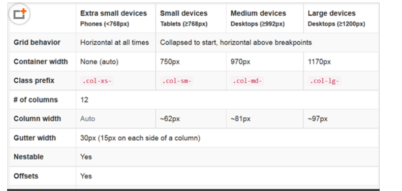

## Bootstrap

### 网格系统

#### 容器
1. container
```html
    <!-- 固定宽度水平居中显示 -->
    <section class="container">
        <p>
            “这么多年，我一直在学习一件事情，就是不回头，只为自己没有做过的事情后悔，不为自己做过的事情后悔。
            人生每一步行来，都是需要付出代价的。我得到了我想要的一些，失去了我不想失去的一些。
            可这世上的芸芸众生，谁又不是这样呢？” 
        </p>
    </section>
```
2. container-fluid
```html
    <!-- 内容撑满整个浏览器 -->
    <section class="container-fluid">
        <p>
            “这么多年，我一直在学习一件事情，就是不回头，只为自己没有做过的事情后悔，不为自己做过的事情后悔。
            人生每一步行来，都是需要付出代价的。我得到了我想要的一些，失去了我不想失去的一些。
            可这世上的芸芸众生，谁又不是这样呢？” 
        </p>
    </section>
```

#### 行、列
> Bootstrap 将页面分为行（.row），每行 12 列（.col-md-*）。行必须包含在容器里，根据屏幕大小不同，列又分为.col-xs-、.col-sm-、.col-md-、.col-lg-，分别对应手机(<768px)、平板(≥768px)、中等屏幕电脑(≥992px)和大屏幕电脑(≥1200px)。其中出现的这些像素称为临界点，每当浏览器大小或屏幕尺寸从一个临界点到达另一个临界点时，相应的 CSS 类就会起作用，页面布局就会发生变化。



1. col-md-*
打开浏览器，可以看到它们各自占据了 12 列中的 3、6、3 列，加起来恰好是 12 列。如果我们缩小浏览器窗口，直到其小于 970px，此时会发现变成了三行，堆在一起显示。除过.col-xs-，其他 CSS 类的行为都一样，在屏幕尺寸小于其临界点时，会堆起来显示，只有在屏幕尺寸大于其临界点时，才按列显示，而.col-xs- 在任何情况下都按列显示。
```html
    <!-- 在电脑端和手机端显示不同的列数 -->
    <section class="container">
        <!-- 行 -->
        <div class="row">
            <!-- 列 -->
            <div class="col-md-3">col-md-3</div>
            <div class="col-md-6">col-md-6</div>
            <div class="col-md-3">col-md-3</div>
        </div>
    </section>
```
2. col-xs-6 最小单位 
```html
    <!-- 所有设备上显示同数量的列 -->
    <section class="container">
        <div class="row">
            <div class="col-xs-6">col-xs-6</div>
            <div class="col-xs-6">col-xs-6</div>
        </div>
    </section>
```
3. 混合
对应不同屏幕尺寸的 CSS 类可以混合使用，比如我想让一个页面在电脑上显示 3 列，在手机上显示成 2 列，则可编写代码如下，在手机上，第三列会换行到下一行显示，并且占据行宽的一半
```html
    <section class="container">
        <!-- 行 -->
        <div class="row">
            <!-- 列 -->
            <div class="col-xs-6 col-md-3">col-md-3</div>
            <div class="col-xs-6 col-md-6">col-md-6</div>
            <div class="col-xs-6 col-md-3">col-md-3</div>
        </div>
    </section>
```
4. col-md-offset-*
```html
    <!-- 列偏移，第一列占行宽的 1/4，第二列向右偏移 6 列，占用行末的 3 列 -->
    <section class="container">
        <div class="row">
            <div class="col-md-3">col-xs-3</div>
            <div class="col-md-3 col-md-offset-6">col-xs-3</div>
        </div>
    </section>
```
5. col-md-push-* 和 .col-md-pull-*
列的顺序也可以通过.col-md-push-* 和 .col-md-pull-* 调整，它们的含义是将某元素向后推或向前拉若干列，开发者可使用该特性，将重要内容在手机显示时，拉到前面
```html
    <!-- 推拉列，先退后进 -->
    <section class="container">
        <div class="row">
            <!-- 向后退3 -->
            <div class="col-md-9 col-md-push-3">col-md-9</div>
            <!-- 向前进9 -->
            <div class="col-md-3 col-md-pull-9">col-md-3</div>
        </div>
    </section>
```